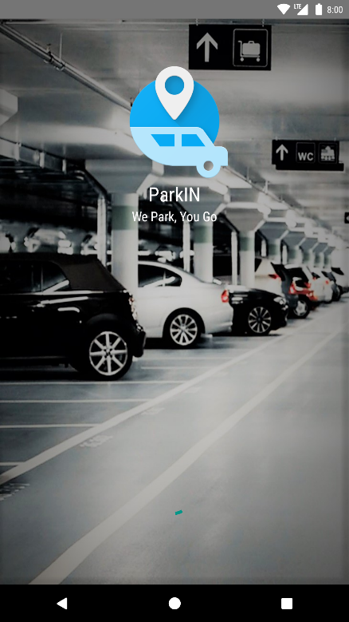
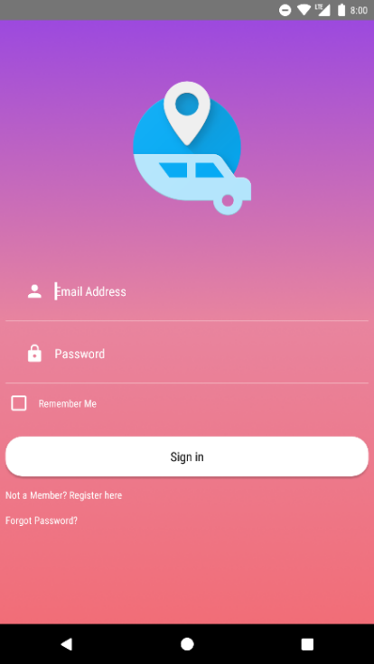
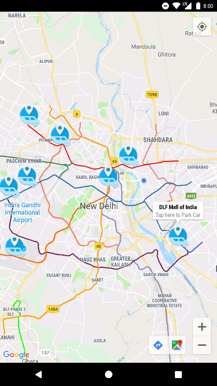
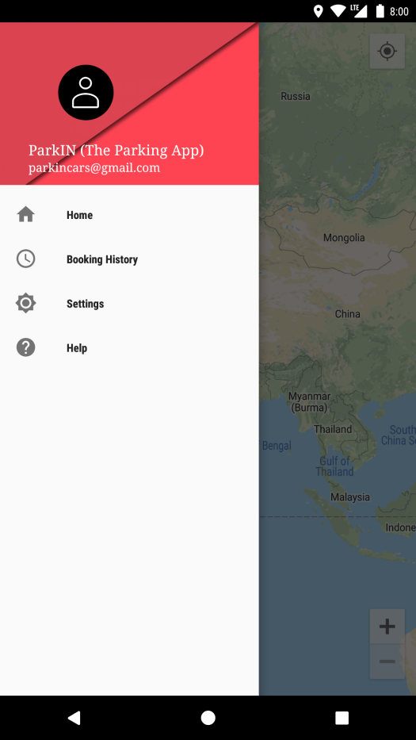
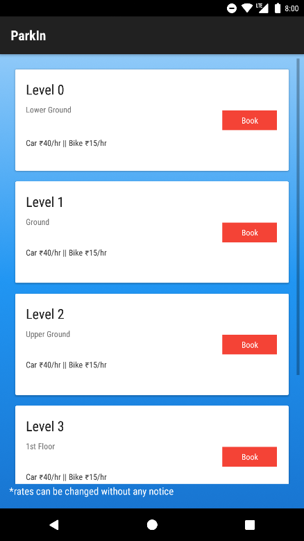
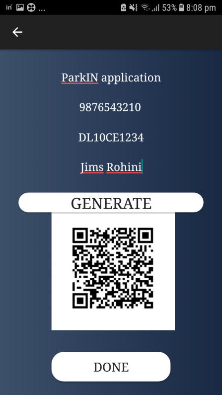
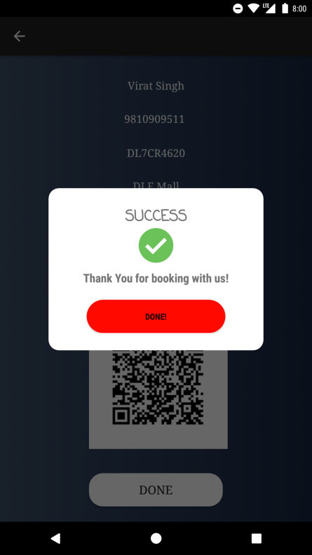

# ParkIN
1.1 Brief Description of the System
This project is designed so as to be used by Parking Company specializing in making vehicle
parking available to customers using their smartphones from anywhere, anytime. It is an
online app through which customers can view available car parking slots, register, view
profile and book car parking.
1.2 Purpose of the System & Scope
The advancement in Information Technology and internet penetration has greatly enhanced
various business processes and communication between companies (services provider) and
their customers of which car parking industry is not left out. This E-parking system is
developed to provide the following services:
• Enhance Business Processes: To be able to use internet technology to project the Parking
company to the global world instead of limiting their services to their local domain alone,
thus increase their return on investment (ROI).
• Online Parking Reservation: A tools through which customers can reserve available
Parking spots to save time.
• Customer’s registration: A registration portal to hold customer’s details, monitor their
transaction and used same to offer better and improve services to them.
This project traverse a lot of areas ranging from business concept to computing field and
required to perform several researches to be able to achieve the project objectives.
The area covers include:
 Parking industry: this includes the study on how the parking business is being done,
process involved and opportunity that exist for improvement.
 JAVA technology used for the development of the application.
 General customer as well as company’s staff will be able to use the application
effectively.
1.7 System Requirement Tools: 
∙ HARDWARE REQIRMENTS  
1. RAM 2 GB or Higher  
2. Disk Space: 50 MB or More 
3. Processor Speed : 3.5 GHz 
∙ SOFTWARE REQUIREMENTS 
1. Firebase 
2. Operating System: Windows 7 or above 
3. Any Web Browser 
4. Android Version 4.4 & above

### Application user interface
****
<table>
  <tr>
    <td>Welcome Screen</td>
     <td>Registration Page</td>
     <td>Login Page</td>
  </tr>
  <tr>
    <td></td>
    <td></td>
    <td></td>
  </tr>
  <tr>
     <td>Maps Layout</td>
     <td>Slot Booking</td>
     <td>Booking Details</td>
  </tr>
  <tr>
    <td></td>
    <td></td>
    <td></td>
  </tr>
  <tr>
     <td>Booking Done</td>
    <tr>
  <td></td>
  </tr>
 
 </table>
 
